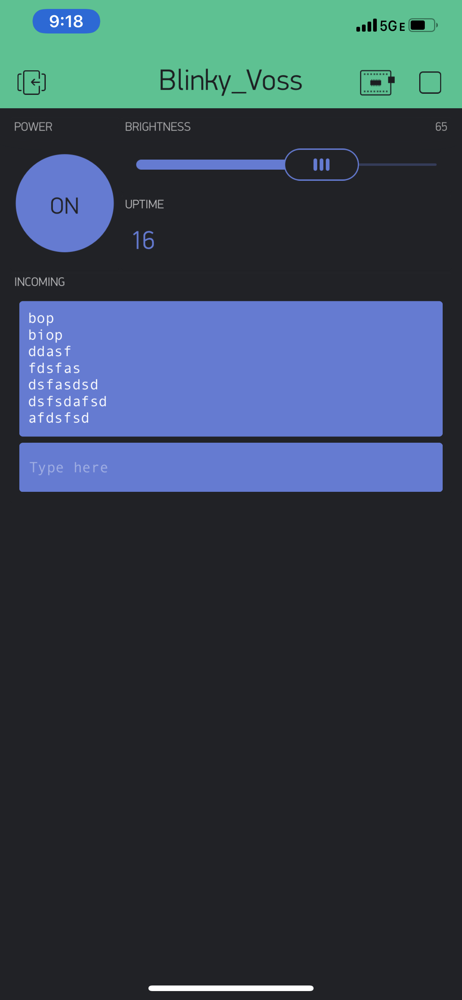

Name:Jonathan Voss

EID: jmv3323

Team Number: 4

## Questions

1. What is the purpose of an IP address?

    IP adresses give a unique name, or ID, to each device on a network to allow machines to
	identify one another.

2. What is a DNS? What are the benefits of using domain names instead of IP addresses?

    the Domain Name Service, this maps a symbolic name to its respective IP address.
	this is great becuase a 32 bit number is difficult to memorize for humans.

3. What is the difference between a static IP and a dynamic IP?

    A static IP address will not change, while Dynamic IPs can. Static is better for server/website hosting as the IP will not
	change, but Dynamic is not only cheaper but also easier for everyday use and potentially more secure as it can change.

4. What is the tradeoff between UDP and TCP protocols?

    While TCPs have no loss and are thus more reliable, UDP is connectionless and faster, but more unreliable.
	
5. Why can't we use the delay function with Blynk?

    Blynk is event based, meaning it must use timing to determine actions,, and a delay would
	mess with the timing and break the code.

6. What does it mean for a function to be "Blocking"?

    A blocking function will not allow any other code to run while it is running- it "blocks" all other code
	from executing.

7. Why are interrupts useful for writing Non-Blocking code?

    interrupts allow code to excecute in the middle of what would be "blocking" code, allowing the code to run 
	at seperate times, rendering the code non-blocking and allowing the processor to choose (based on priority) what
	code to excecute.

8. What is the difference between interface and implementation? Why is it important?

   interface decides how a function is called/accessed (and is usually in the header file), while
   implementation defines what the code does when it is called. This is important because they are 
   seperate. In Blynk, they define the interface while we, the programmer, decide the implimentation.

9. Screenshot of your Blynk App:

    
